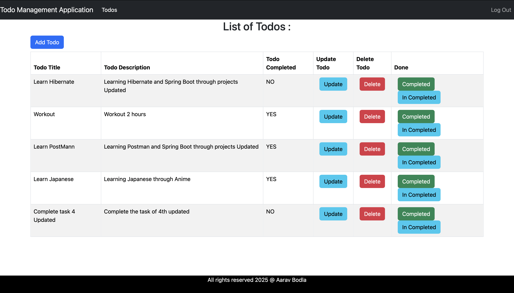
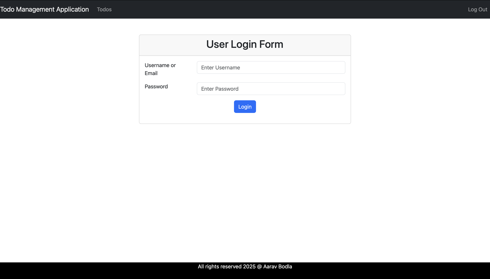

# TODO Management WebApp

A full-stack web application built using **Java**, **Spring Boot 3**, **Spring Data JPA**, **Spring Security**, **JWT**, **React JS**, **JavaScript**, and **MySQL**.

---

## Features

### **Backend**
- Spring Boot 3 for REST APIs
- Spring Data JPA for database interaction
- Spring Security & JWT for authentication & authorization
- MySQL database integration

### **Frontend**
- React JS with functional components and hooks
- Axios for API requests
- React Router for navigation
- Responsive UI

---

## 🛠 Tech Stack
**Backend:**
- Java 17+
- Spring Boot 3
- Spring Data JPA
- Spring Security + JWT
- Maven or Gradle

**Frontend:**
- React JS
- JavaScript (ES6+)
- Axios
- React Router

**Database:**
- MySQL


---

## ⚙️ Getting Started

### 1️⃣ Clone the repository
```bash
git clone https://github.com/aaravbodla/Todo-Management.git
cd your-repo-name

cd backend
# Configure database in src/main/resources/application.properties
# Example:
# spring.datasource.url=jdbc:mysql://localhost:3306/your_db
# spring.datasource.username=root
# spring.datasource.password=your_password

mvn clean install
mvn spring-boot:run

cd frontend
npm install
npm start
```
## 📸 Screenshots

### Home Page


### Login Page

